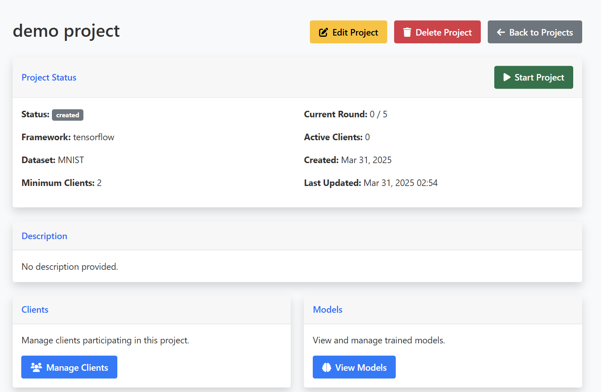
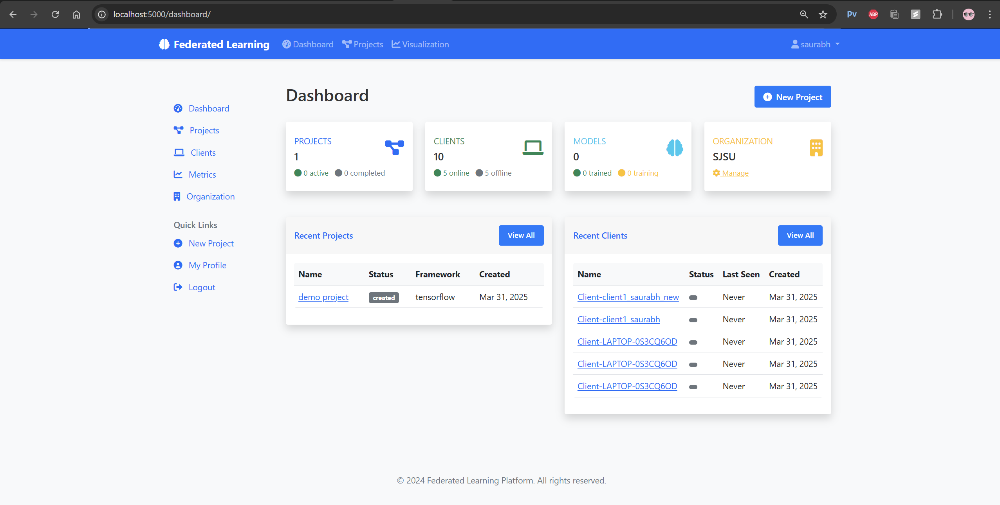
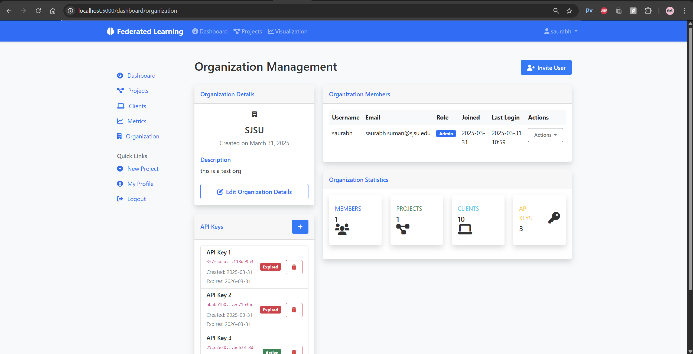
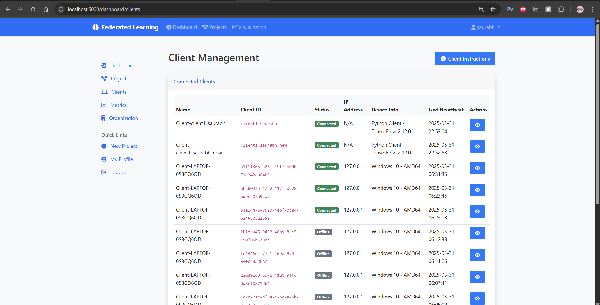
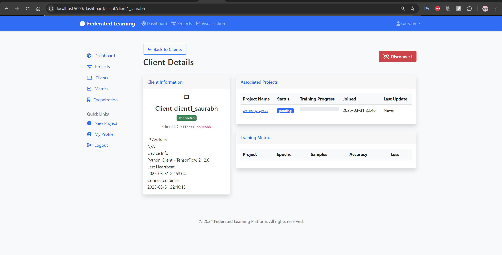

# HelioSync (A Federated Learning Platform)

Presenting HelioSync, a comprehensive platform for running federated learning projects across multiple devices while preserving data privacy.

## Screenshots

Here are a few snapshots of the platform in action:






## Features

- **Privacy Preserving Learning**: Train machine learning models without sharing raw data
- **Multi-Framework Support**: Use TensorFlow or PyTorch for model development
- **Organization Management**: Create and manage organizations with multiple users
- **Client Management**: Register and monitor client devices participating in training
- **Project Dashboard**: Track project progress, metrics, and model performance
- **Model Deployment**: Deploy trained models as APIs or download for local use
- **Real-time Metrics**: Monitor training progress with visualizations
- **API Access**: Programmatic access for client integration

## Architecture

The platform consists of the following components:

- **Web Interface**: Flask-based web application for managing federated learning projects
- **Federated Server**: Coordinates the training process and aggregates model updates
- **Federated Clients**: Run on devices with local data, train models without sharing data
- **Examples**: Pre-built examples for common datasets (MNIST, CIFAR-10, Sentiment Analysis)

## Installation

### Prerequisites

- Python 3.8+
- pip (Python package manager)
- Virtual environment tool (recommended)

### Setup

1. Clone the repository:
```bash
git clone https://github.com/yourusername/federated-learning-platform.git
cd federated-learning-platform
```

2. Create and activate a virtual environment:
```bash
python -m venv venv
source venv/bin/activate  # On Windows: venv\Scripts\activate
```

3. Install the dependencies:
```bash
pip install -r requirements.txt
```

4. Initialize the database:
```bash
python init_db.py
```
Follow the prompts to create an admin user and organization. **Make sure to save the API key** that is displayed after initialization.

## Running the Application

### Development Mode

To run the application in development mode:

```bash
python run.py --config development --debug
```

The application will be available at http://localhost:5000.

### Production Mode

For production deployment:

```bash
python run.py --config production --host 0.0.0.0 --port 5000
```

## Using the Platform

1. **Login**: Access the web interface and login with the admin credentials created during setup
2. **Create Project**: Set up a new federated learning project with the desired dataset and parameters
3. **Register Clients**: Use the API key to register client devices that will participate in training
4. **Start Training**: Launch the federated training process from the project dashboard
5. **Monitor Progress**: Track metrics and model performance in real-time
6. **Deploy Model**: Once training is complete, deploy the model as an API or download it

## Client Configuration

To configure a client to participate in federated learning:

1. Ensure you have the required dependencies:
```bash
pip install requests
```

2. Run the federated client with your API key:
```bash
python -m fl_client.run_client --client_id client1_saurabh --api_key API_KEY    --server_url http://localhost:5000 --batch_size 32  --epochs 5     --data_split 0.5
```

3. Command line options:
```
--server        Server URL (default: http://127.0.0.1:5000)
--api_key       API key for authentication
--name          Client name (defaults to hostname)
--verbose       Enable verbose logging
```

4. Or import the client in your own code:
```python
from federated_client import FederatedClient

# Initialize client
client = FederatedClient(
    server_url="http://your-server-url:5000",
    api_key="your-api-key",
    client_name="my-device"
)

# Start and run the client
if client.start():
    client.run()
```

## Example Projects

### MNIST Handwritten Digits

The platform includes an example federated learning project for MNIST digit recognition:

```bash
cd examples/mnist
python run_server.py  # Start the federated server
python run_client.py --client-id 1  # Start a client instance
```

### CIFAR-10 Image Classification

For CIFAR-10 image classification:

```bash
cd examples/cifar10
python run_server.py
python run_client.py --client-id 1
```

### Sentiment Analysis

For text sentiment analysis:

```bash
cd examples/sentiment
python run_server.py
python run_client.py --client-id 1
```

## API Documentation

The platform provides a RESTful API for client integration:

### Authentication
All API requests require a valid API key, which should be included in the `X-API-Key` header.

### Client Registration
- `/api/register_client`: Register a new client (primary endpoint)
- `/api/client/register`: Alias for client registration
- `/api/clients/register`: Alias for client registration
- `/api/register`: Alias for client registration

### Client Heartbeat
- `/api/client/heartbeat`: Update client status with heartbeat
- `/api/clients/heartbeat`: Alias for client heartbeat
- `/api/clients/<client_id>/heartbeat`: Update status for a specific client ID

### Tasks and Projects
- `/api/clients/tasks`: Get available tasks for a client
- `/api/projects`: Get available projects
- `/api/projects/<project_id>/server_info`: Get server information for a project
- `/api/projects/<project_id>/update_status`: Update project status

### Health Check
- `/api/health`: Check server status

For detailed API usage examples, see the documentation in the web interface.

## Contributing

Contributions are welcome! Please feel free to submit a Pull Request.

## License

This project is licensed under the MIT License - see the LICENSE file for details. 
