# Federated Learning System Documentation

## System Architecture

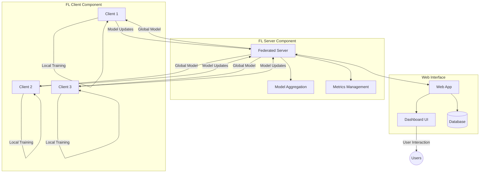

The federated learning system consists of three main components:
1. **Client Component** (`fl_client`)
2. **Server Component** (`fl_server`)
3. **Web Interface** (`web`)

These components work together to enable distributed model training across multiple clients while keeping data private.

## Client-Server Communication Flow

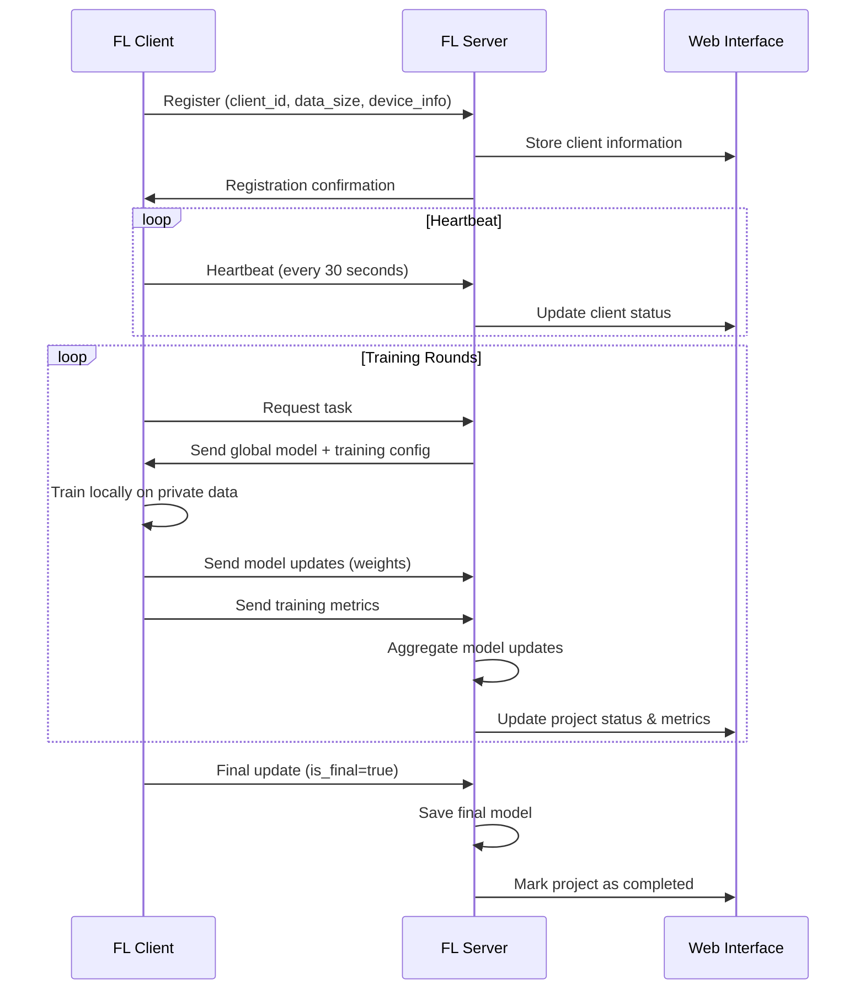

## Key Components and Features

### 1. FL Client Component

**Key Features:**
- Client registration with server
- Local model training on private data
- Secure model update transmission to server
- Automatic polling for training tasks
- Heartbeat mechanism for connection monitoring
- Robust error handling and retry mechanisms

The client component is responsible for:
1. Registering with the federated learning server
2. Training models locally on private data
3. Sending model updates to the server without sharing raw data
4. Receiving aggregated global model for further training

```python
# Client initialization example
client = FederatedClient(
    client_id="client_123",
    model=model, 
    x_train=train_data, 
    y_train=train_labels,
    batch_size=32,
    epochs=5
)
client.start()
```

### 2. FL Server Component

**Key Features:**
- Coordination of federated learning process
- Client management and authentication
- Model weight aggregation with FedAvg algorithm
- Training round management
- Performance metrics collection and analysis
- Global model distribution

The server component:
1. Manages connected clients and their status
2. Distributes the global model to clients
3. Aggregates model updates from clients
4. Tracks training progress and metrics
5. Handles client failures gracefully

```python
# Server initialization example
server = FederatedServer(
    model=initial_model,
    min_clients=2,
    rounds=10
)
server.start()
```

### 3. Web Interface

**Key Features:**
- User authentication and authorization
- Organization-based access control
- Project creation and management
- Real-time training monitoring
- Visualization of training metrics
- Model deployment capabilities
- Client monitoring dashboard

The web interface provides:
1. User and organization management
2. Project creation and configuration
3. Training monitoring and visualization
4. Model deployment tools
5. API for client-server communication

## Client Lifecycle States

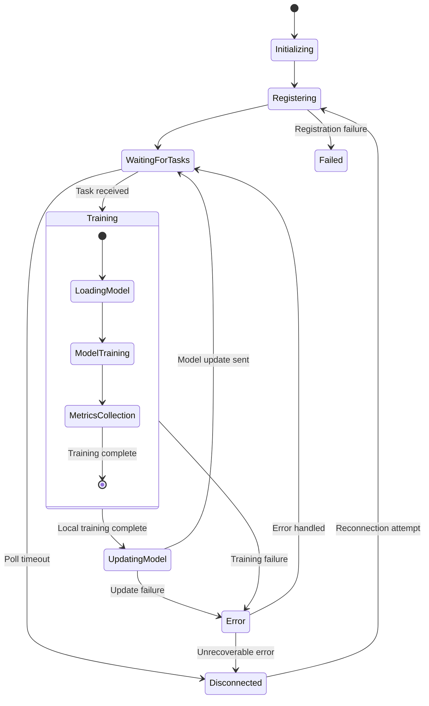

## Project Lifecycle States

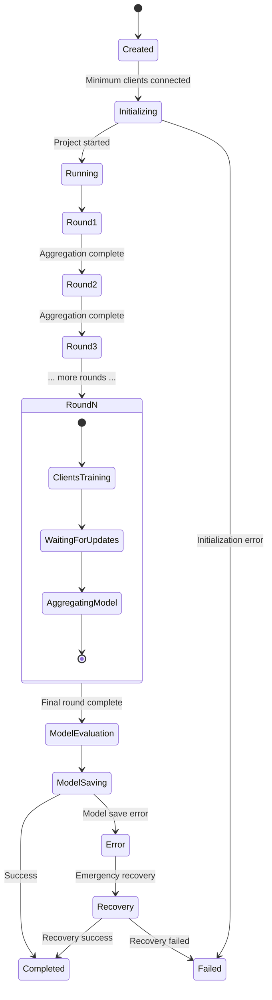

## Federated Learning Workflow

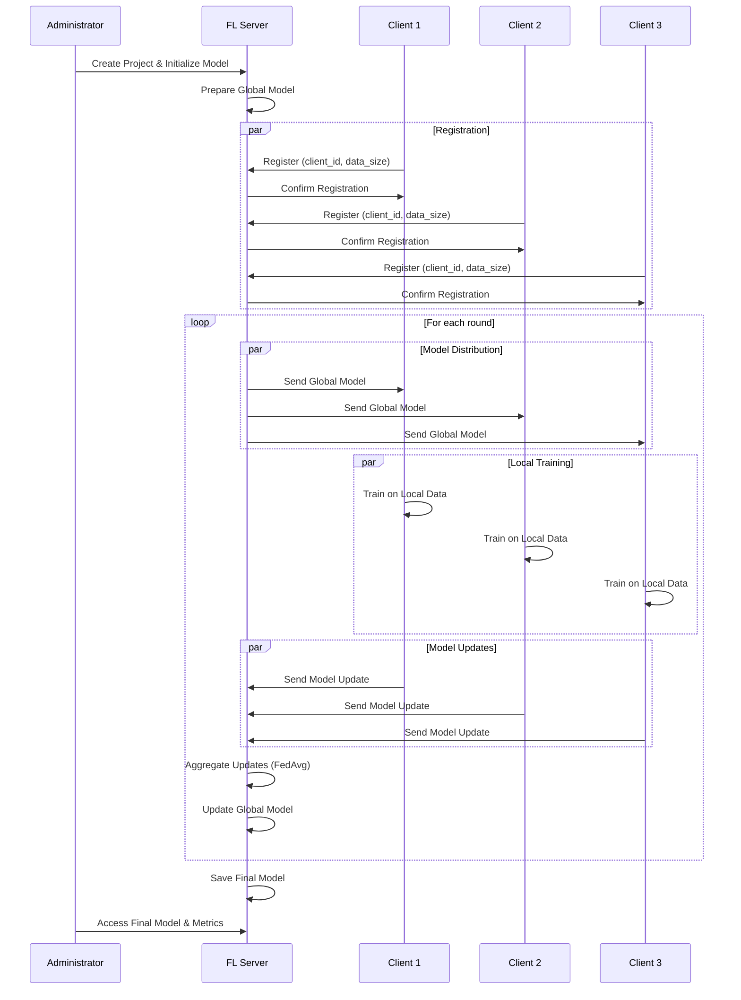

## Error Handling & Recovery Mechanisms

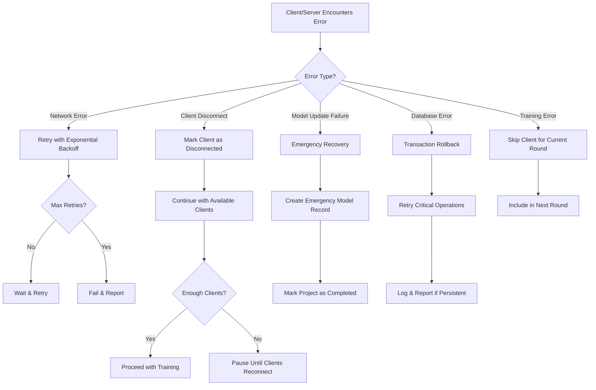

## Model Aggregation

The federated learning system uses Federated Averaging (FedAvg) for model aggregation, which is a weighted average of client models based on their data sizes.

### Standard FedAvg Algorithm

The FedAvg algorithm works as follows:

1. Let $w^t$ be the global model weights at round $t$
2. Let $w_k^{t+1}$ be the updated weights from client $k$ after training locally
3. Let $n_k$ be the number of training samples on client $k$
4. Let $n = \sum_{k=1}^K n_k$ be the total number of training samples across all clients

The aggregated global model for round $t+1$ is computed as:

$$ w^{t+1} = \sum_{k=1}^K \frac{n_k}{n} w_k^{t+1} $$

This weighted averaging ensures that clients with more data have a proportionally larger influence on the global model.

### Performance-Weighted FedAvg (PerfFedAvg)

We have implemented PerfFedAvg, an innovative aggregation algorithm that dynamically weights client contributions based on both data size and local model quality (validation accuracy or loss).

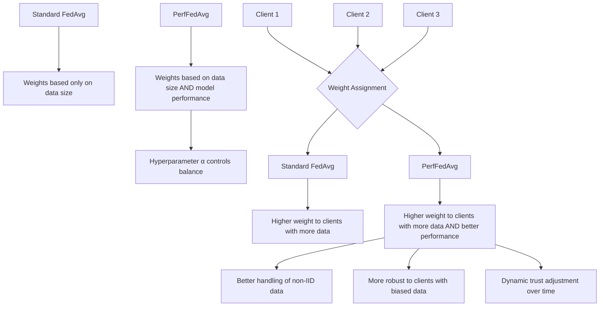

#### Mathematical Formulation

Let:
- $w_k^t$: Model weights of client $k$ at round $t$
- $n_k$: Number of samples on client $k$
- $acc_k^t$: Validation accuracy of client $k$'s model at round $t$
- $\alpha \in [0,1]$: Hyperparameter balancing data size and performance weighting
- $\eta_k^t$: Client's effective contribution weight

We define the effective contribution weight as:

$$ \eta_k^t = \alpha \cdot \frac{n_k}{\sum_j n_j} + (1-\alpha) \cdot \frac{acc_k^t}{\sum_j acc_j^t} $$

Then, the global model is updated as:

$$ w^{t+1} = \sum_{k=1}^K \eta_k^t \cdot w_k^t $$

#### Interpretation

- If $\alpha = 1$ → reduces to classic FedAvg (only data size matters)
- If $\alpha = 0$ → pure accuracy-based weighting (only performance matters)
- Intermediate values blend sample size trust with observed model generalization

#### Advantages Over Standard FedAvg

1. **Non-IID Robustness**: Clients with biased or unhelpful data (poor generalization) are automatically downweighted
2. **Dynamic Trust**: A client's impact evolves over time based on current model quality
3. **Personalization-Compatible**: Clients that overfit to local data (low validation accuracy) contribute less
4. **Adaptive Learning**: System naturally adapts to heterogeneous client capabilities

#### Implementation Details

PerfFedAvg is implemented by extending the standard aggregation method:

```python
def _aggregate_weights_perfedavg(self, project_id, alpha=0.5):
    """Aggregate weights using Performance-Weighted FedAvg."""
    client_weights = self.client_weights[project_id]
    
    # Get the first client's weights to determine the structure
    first_client = next(iter(client_weights.values()))
    first_weights = first_client['weights']
    
    # Initialize aggregated weights with zeros
    aggregated_weights = [np.zeros_like(w) for w in first_weights]
    
    # Calculate total data size
    total_data_size = sum(client['data_size'] for client in client_weights.values())
    
    # Calculate total accuracy (for normalization)
    total_accuracy = sum(client['metrics'].get('val_accuracy', 0.5) 
                         for client in client_weights.values())
    
    # If no accuracy metrics, fall back to standard FedAvg
    if total_accuracy == 0:
        logger.warning("No accuracy metrics available, falling back to standard FedAvg")
        return self._aggregate_weights(project_id)
    
    # Calculate effective contribution weights with PerfFedAvg
    for client_id, client_data in client_weights.items():
        client_weights_list = client_data['weights']
        client_data_size = client_data['data_size']
        client_accuracy = client_data['metrics'].get('val_accuracy', 0.5)
        
        # Calculate data size component
        data_weight = client_data_size / total_data_size if total_data_size > 0 else 1.0/len(client_weights)
        
        # Calculate accuracy component
        accuracy_weight = client_accuracy / total_accuracy if total_accuracy > 0 else 1.0/len(client_weights)
        
        # Combined weight using alpha
        weight_factor = alpha * data_weight + (1 - alpha) * accuracy_weight
        
        logger.info(f"Client {client_id} - Data weight: {data_weight:.4f}, "
                   f"Accuracy weight: {accuracy_weight:.4f}, "
                   f"Combined weight: {weight_factor:.4f}")
        
        # Sum up the weighted contributions
        for i, w in enumerate(client_weights_list):
            aggregated_weights[i] += w * weight_factor
    
    logger.info(f"Aggregated weights using PerfFedAvg with alpha={alpha}")
    return aggregated_weights
```

### Model Aggregation Process

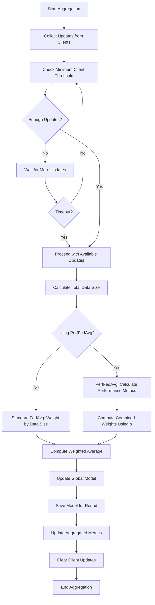

### Code Implementation

The standard aggregation is implemented in the `_aggregate_weights` method of the `FederatedServer` class:

```python
def _aggregate_weights(self, project_id):
    client_weights = self.client_weights[project_id]
    
    # Get the first client's weights to determine the structure
    first_client = next(iter(client_weights.values()))
    first_weights = first_client['weights']
    
    # Initialize aggregated weights with zeros
    aggregated_weights = [np.zeros_like(w) for w in first_weights]
    
    # Calculate total data size
    total_data_size = sum(client['data_size'] for client in client_weights.values())
    
    if total_data_size == 0:
        # If data size is 0, use equal weighting
        weight_factor = 1.0 / len(client_weights)
        
        # Sum up with equal weighting
        for client_id, client_data in client_weights.items():
            client_weights_list = client_data['weights']
            
            # Sum up contributions with equal weighting
            for i, w in enumerate(client_weights_list):
                aggregated_weights[i] += w * weight_factor
    else:
        # Weighted averaging based on data size
        for client_id, client_data in client_weights.items():
            client_weights_list = client_data['weights']
            client_data_size = client_data['data_size']
            
            # Weighted contribution
            weight_factor = client_data_size / total_data_size
            
            # Sum up the weighted contributions
            for i, w in enumerate(client_weights_list):
                aggregated_weights[i] += w * weight_factor
    
    return aggregated_weights
```

## Model Saving and Deployment Flow

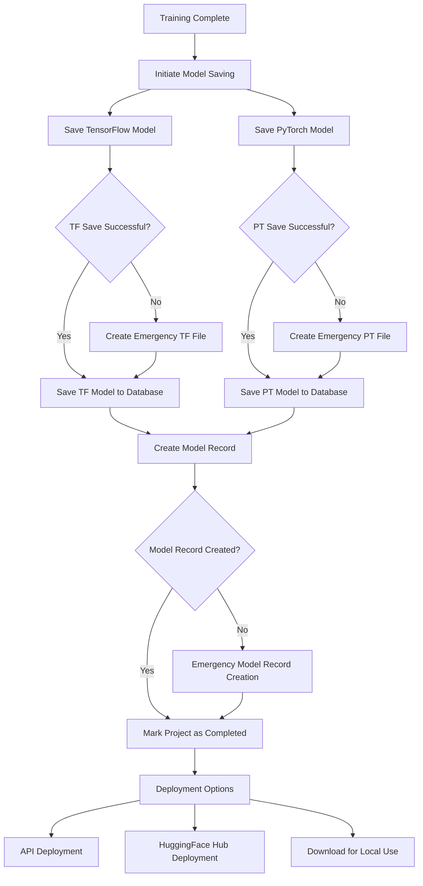

## Data Flow Diagram

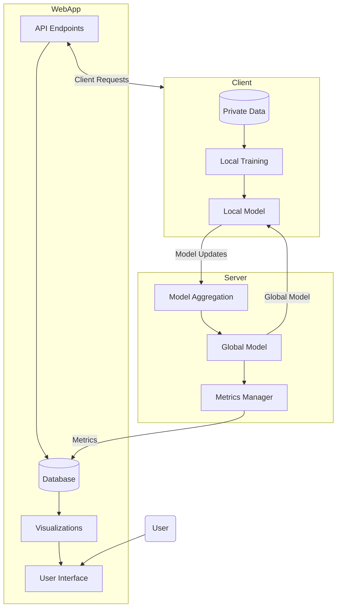

The system maintains data privacy by never sharing raw data between components:

1. **Client Data:** Never leaves the client device
2. **Model Updates:** Only model parameters are shared
3. **Aggregated Model:** Combined from multiple clients without accessing original data

## Security Features

- **API Authentication:** Secure API keys for client-server communication
- **User Authentication:** Role-based access in web interface
- **Organization Isolation:** Data and models are separated by organization
- **Encrypted Communication:** Secure data transmission protocols

## Database Schema

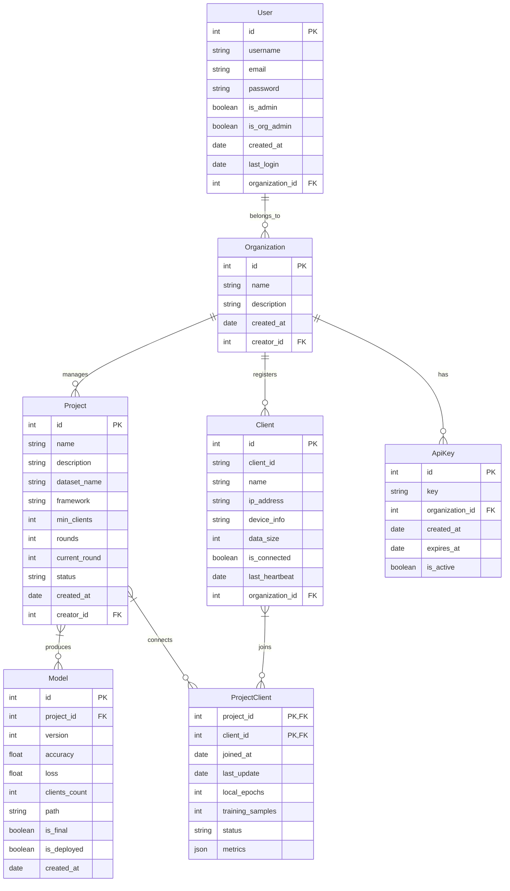

The system uses a relational database to store:
- Users and organizations
- Projects and models
- Client information and metrics
- Training history and results

## Conclusion

This federated learning system provides a comprehensive solution for training machine learning models across distributed clients while preserving data privacy. It combines:

1. **Privacy-Preserving Learning:** Trains on data that never leaves client devices
2. **Scalable Architecture:** Supports multiple organizations, projects, and clients
3. **Robust Implementation:** Handles network failures and client disconnections
4. **User-Friendly Interface:** Web dashboard for monitoring and management
5. **Secure Communication:** Authentication and encrypted data transmission

The system is suitable for various applications where data privacy is critical, such as healthcare, finance, and sensitive enterprise applications.
